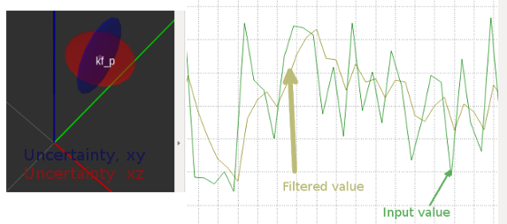

# simple_kf

## Overview

This package subscribes to **`/cam_pose_in_world`** ([geometry_msgs/PoseWithCovarianceStamped]) to get the measurements for internal Kalman Filtering.
Kalman Filtering is done using opencv's kf library. The result is published as **`/cam_pose_in_world_kf`** ([alfons_msgs/KfState]) which contains the estimated position, velocity and acceleration.

**Author: Markus Lamprecht<br />
Maintainer: Markus Lamprecht, 2f4yor@gmail.com<br />**



## Installation

### Dependencies

This software is built on the Robotic Operating System ([ROS]), which needs to be [installed](http://wiki.ros.org) first. Additionally, this package depends on following software:

- [alfons_msgs]
- opencv

### Building

In order to install this package, clone the latest version from this repository into your catkin workspace and compile the package using [catkin_tools](https://catkin-tools.readthedocs.io/en/latest/)

``` 
mkdir -p catkin_ws/src
cd catkin_ws/src/
git clone git@github.com:CesMak/simple_kf.git 
cd ..
catkin init 
catkin build
source devel/setup.bash
```

## Basic Usage

- A linear model is used as defined in **src/kalman_filter.cpp**
```
    // [ 1  0  0  dt   0   0  1/2*dt^2 0        0       ]
    // [ 0  1  0   0  dt   0  0        1/2*dt^2 0       ]
    // [ 0  0  1   0   0  dt  0        0        1/2*dt^2]
    // [ 0  0  0   1   0   0  dt       0        0       ]
    // [ 0  0  0   0   1   0  0        dt       0       ]
    // [ 0  0  0   0   0   1  0        0        dt      ]
    // [ 0  0  0   0   0   0  1        0        0       ]
    // [ 0  0  0   0   0   0  0        1        0       ]
    // [ 0  0  0   0   0   0  0        0        1       ]
```

- Use t**src/kalman_filter.cpp** to adjust it for measurement and process noise. 
- You can also adjust the launch file **launch/start_simple_kf.launch** to test this package with a bag in /data

## Main Launch file

``` 
roslaunch simple_kf start_simple_kf.launch
``` 

## License BSD
If you want to use this package please contact: [me](https://simact.de/about_me).


## TODO's

-> if motion blur or if no marker detected somehow stops does not predict further....
- seems currently to not work as I want it to work....
- plotting the kf see also here: http://wiki.ros.org/rviz_plugin_covariance
- extend to also use a kalman filter for the orientation
- Compare code with [reference](https://github.com/Myzhar/simple-opencv-kalman-tracker/blob/master/source/opencv-kalman.cpp) to check why it does not estimate in the future....

[ROS]: http://www.ros.org
[rviz]: http://wiki.ros.org/rviz
[grid_map_msg/GridMap]: https://github.com/anybotics/grid_map/blob/master/grid_map_msg/msg/GridMap.msg
[sensor_msgs/PointCloud2]: http://docs.ros.org/api/sensor_msgs/html/msg/PointCloud2.html
[geometry_msgs/PoseWithCovarianceStamped]: http://docs.ros.org/api/geometry_msgs/html/msg/PoseWithCovarianceStamped.html
[tf/tfMessage]: http://docs.ros.org/kinetic/api/tf/html/msg/tfMessage.html
[std_srvs/Empty]: http://docs.ros.org/api/std_srvs/html/srv/Empty.html
[grid_map_msg/GetGridMap]: https://github.com/anybotics/grid_map/blob/master/grid_map_msg/srv/GetGridMap.srv
[grid_map_msgs/ProcessFile]: https://github.com/ANYbotics/grid_map/blob/master/grid_map_msgs/srv/ProcessFile.srv
[alfons_msgs/KfState]: https://github.com/CesMak/alfons_msgs/blob/master/msg/KfState.msg
[alfons_msgs]: https://github.com/CesMak/alfons_msgs